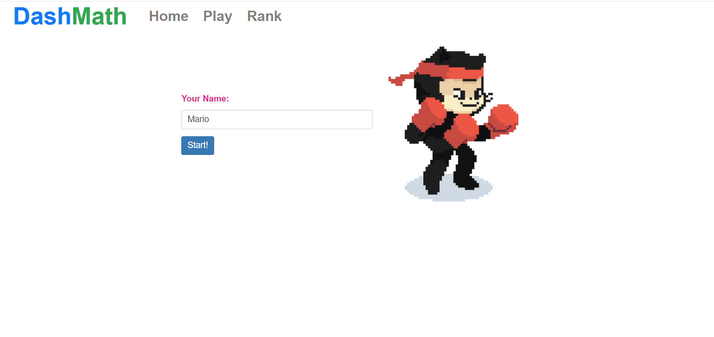
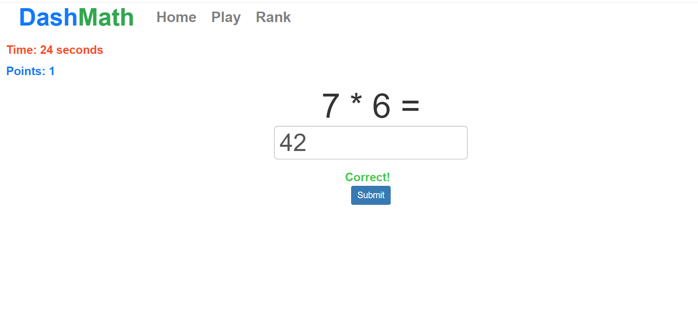
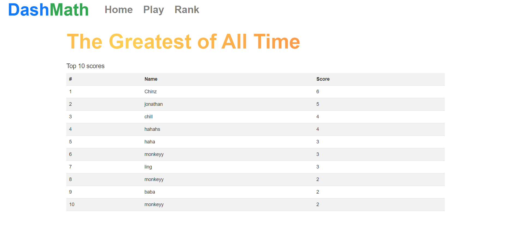

# Dash Math
Dash Math is an arithmetic math game for people of all ages. Players attempt to complete as many arithmetic questions in 1 minute. The motivation behind creating this game is for users to have some short fun and keep their numerical reasoning sharp. 

## Video

## Features
- 1 minute gameplay with timer
- Top 10 scores for the 3 levels will be displayed 

## Tech
- Java (Spring Boot)
- Angular, Bootstrap
- Java Persistence API
- SQL (h2)

## Further improvements
- Provide different levels of difficulty
- Provide different math games like calculating percentages, ranges 

## Run the programme
1. git clone https://github.com/nchinling/mental-math-game.git